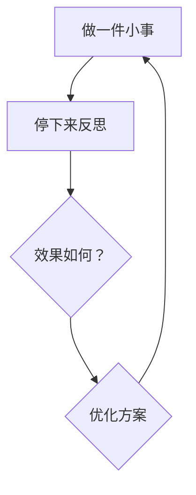

Self-learning is a skill

<!--
## Hi ，I'm  there 👋


**廖定玖/阿玖说事** is a ✨ _special_ ✨ repository because its `README.md` (this file) appears on your GitHub profile.

Here are some ideas to get you started:

- 🔭 I’m currently working on ...
- 🌱 I’m currently learning ...
- 👯 I’m looking to collaborate on ...
- 🤔 I’m looking for help with ...
- 💬 Ask me about ...
- 📫 How to reach me: ...
- 😄 Pronouns: ...
- ⚡ Fun fact: ...
-->

> 从通话时长（s）到流量大小（Byte),再到词元（Token），人类科技正在经历一场全新的科技变革，每个人都感到这个世界变化太快，但是你总得做点什么，才能让你有所改变。


- **🔭 每天写点什么，而不是爆款文章 ...**
- **🌱 每天拍点什么，而不是爆款视频...**
- **👯 每天冥想10 分钟，而不是让大脑占满 ...**
- **🤔 每天投资点什么，而不是追求短期收益...**
- **💬 每周运动一下， 而不是花钱去健身...**


### 在AI时代，如何证明你会AI？`

最好的办法就是立马行动用上AI，

然后把你使用的过程记录下来。

因为，这个记录过程，远远比学更加重要，

学习是掌握 AI 个工具，而记录却是你成长的过程。

如何记录，用什么记录工具原本并不重要，

但是我强烈推荐你用的是 Git 来记录下来。

其实你每天需要发布时，到终端里面跑一行代码就可以完成这个记录：

``bash``
`cd ~/self-learning-is-a-skill && git add -A && git commit -m "update" && git push`

Git 最好的是版本管理，其实这不只是版本管理，

他将记录你的成长的历程，还能让全世界看到你。

为什么要这么做？

因为一个人的财富，等于他的能力乘以影响力。

比如你在单位，你是一个普通员工，那么你的影响力很小，

但是如果你成为了部门领导，甚至是公司领导，你影响的人就越多，

相应的你的财富就会越大，但是这个有一定的天花板的。

如果普通人，你能够掌握杠杆，比如编程，自媒体，出书等，

你的影响力可以成千上万的人看到，这是很多人没有意识到的。

就算意识到了，但是怎么做呢？

自学吧，这世界上没有什么比自学更加重要了，

尤其是现在 AI 时代，你可以学会任何的技能，

阅读能力；
写作能力；
表达能力；
演讲能力；
自媒体能力；
投资能力；
……
赚钱的能力。


### 热门的小龙虾

龙虾 (OpenClaw) 是 2026 年初 AI 圈最热门的大事，


感觉不知道龙虾都落后了。`

前几天看了张一鸣创业日志中他为什么创造头条，

今日头条的本质是抢占了信息流 / 注意力这块市场，

头条负责对信息流的重新匹配。

4月13日中午我突发奇想，我能不能用龙虾（OpenClaw）做一个自己的数字产品。

按照第一性原理，咱们不搞那么复杂的平台，于是就有了阿玖日报。`

从4 月 13 日18 点下载Qclaw 开始，

我只花了不到 3 个小时就完成了阿玖日报整个构想的落地。

这就验证了 Openclaw将将 AI 推入了一个新的时代。

日报简单可以随心所欲，随时记录我们学习成长的轨迹。

我们学习的知识和成长过程，与其放在大脑里，

不如放进知识库里，与其放进知识库里，不如将其放在朋友圈，

与其放在朋友圈，不如放在社交媒体上。

如果还有更牛的地方，就是将你学到的知识以及学知识的过程的记录放Git上。

我要告诉孩子们，不管你今后学什么专业，你最应该拥有的是一个Git账号。

因为这里可以完成一个最朴素的智慧：

输入（学）→ 处理（用）→ 记录（写）→ 反馈（改）

这里，你可以建立你的个人网站，可以放你的程序代码，还可以学习到很多你想学到的有意义、有价值的东西，这可以记录你过去的成长。

前提是你要会一点英语，至少会看懂英语。不过现在门槛已经变低，浏览器可以一键变成中文。

顺便说一下，GitHub上有数百万个开源项目，你可以从中学AI、学写作、学习编程、学数据分析、学产品思维——不需要任何人批准，不需要报名，不需要交钱。

或许未来有一天，你要去应聘，你可一个给他一个Git，看看你成长的轨迹。

GitHub有句话：“你的代码不会说谎，你的commit历史记录了你的成长。”

为什么有时候我们学了很多东西，但是感觉又拿不出手？

那是因为我们很多时候没有输出闭环，这是大部分人犯的错误。`

学而时习之，不亦说乎。

这句话孔子说了两千年，但大多数人还是学了就忘。

所以一边用AI建一个数字产品，一边记录成长的过程。

这就是阿玖日报的来由。

如果你想得到不同的结果，就不要重复做同样的事。

—— 阿尔伯特·爱因斯坦（Albert Einstein）

简单的做一件事情，坚持做下去，你会发现有不一样的事情发生。


## 学习的方法

 2026.5.30

今天看见硅谷天使投资人纳瓦尔的一篇文章，但是让我头皮发麻，深感震惊，整篇文章就 500 字左右，但是足以改变你的人生。

这其实是一个极简的学习系统，是可以运行的。

```
做一件事（）；
思考（）；
看效果（）；
优化（）
重复（）
```


你有没有发现，大多数人都将这个顺序搞错，不是因为他们能力不够，而是因为学习能力太强。当一个事还没有开始，就开始找书，找教程疯狂学习，结果半年下来，还是在原地踏步。还有一种就是每天都在重零开始做一件事情。

普通人具体怎么做呢？

首先，你要去做一件事。记住，哪怕是很小的一件事情，比如写一篇小短文，或者拍一个口播短视频。这是很关键的一点。

然后，停下来反思。反思是为了看方向，方向是在市场里，而不是在脑子里。“每日三省吾身”，这不是说的很好嘛，为什么别人用得这么好，这个是我们值得反思的。

接下来，看反馈效果。大多数人会陷入自以为是的状态，我们要根据别人的反馈，纠正我们意识上的偏差。在工作上，就是听取不同人的一件；而在短视频里面，则是根据平台的数据获得反馈。比如，播放量、点赞量、评论量，分享量，收藏量，完播率，2s 跳出率。


如果这个方案不行，可以直接放弃，如果可行，则优化方案，并按照新的方案重复做一这件事。

当你真正去做一件事，不断去反思，去优化，你会淘汰那些没有用的方法，保留那些有用的方法。

这个过程叫做迭代。




所以，真正学习的过程是迭代，而不是机械式去学习。做好一个事，并不是花一万小时死磕，而是做一万次迭代。
