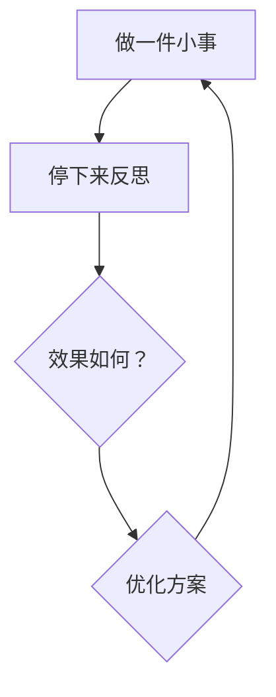

> 从通话时长（s）到流量大小（Byte),再到词元（Token），人类科技正在经历一场全新的科技变革，每个人都感到这个世界变化太快，但是你总得做点什么，才能让你有所改变。


## 在AI时代，如何证明你会AI？`

最好的办法就是立马用上 AI，然后记录下来。或许你最应该用的是 Git 来记录。

龙虾 (OpenClaw) 是 2026 年初 AI 圈最热门的大事，感觉不知道龙虾都落后了。`

前几天看了张一鸣创业日志中他为什么创造头条，今日头条的本质是抢占了信息流 / 注意力这块市场，头条负责对信息流的重新匹配。

4月13日中午我突发奇想，我能不能用龙虾（OpenClaw）做一个自己的数字产品。

按照第一性原理，咱们不搞那么复杂的平台，于是就有了阿玖日报。`

从4 月 13 日18 点下载Qclaw 开始，我只花了不到 3 个小时就完成了阿玖日报整个构想的落地。

这就验证了 Openclaw将将 AI 推入了一个新的时代。

日报简单可以随心所欲，随时记录我们学习成长的轨迹。

我们学习的知识和成长过程，与其放在大脑里，不如放进知识库里，与其放进知识库里，不如将其放在朋友圈，与其放在朋友圈，不如放在社交媒体上。

如果还有更牛的地方，就是将你学到的知识以及学知识的过程的记录放Git上。

我要告诉孩子们，不管你今后学什么专业，你最应该拥有的是一个Git账号。

因为这里可以完成一个最朴素的智慧：

> 输入（学）→ 处理（用）→ 记录（写）→ 反馈（改）

这里，你可以建立你的个人网站，可以放你的程序代码，还可以学习到很多你想学到的有意义、有价值的东西，这可以记录你过去的成长。

前提是你要会一点英语，至少会看懂英语。不过现在门槛已经变低，浏览器可以一键变成中文。

顺便说一下，GitHub上有数百万个开源项目，你可以从中学AI、学写作、学习编程、学数据分析、学产品思维——不需要任何人批准，不需要报名，不需要交钱。

或许未来有一天，你要去应聘，你可一个给他一个Git，看看你成长的轨迹。

> GitHub有句话：“你的代码不会说谎，你的commit历史记录了你的成长。”

为什么有时候我们学了很多东西，但是感觉又拿不出手？

那是因为我们很多时候没有输出闭环，这是大部分人犯的错误。`

> 学而时习之，不亦说乎。

这句话孔子说了两千年，但大多数人还是学了就忘。

所以一边用AI建一个数字产品，一边记录成长的过程。

这就是阿玖日报的来由。

> 如果你想得到不同的结果，就不要重复做同样的事。
>
> —— 阿尔伯特·爱因斯坦（Albert Einstein）

简单的做一件事情，坚持做下去，你会发现有不一样的事情发生。


## 做事方法——要事第一

> “我们要根据原则，而不是根据反应来生活。” —— 史蒂芬·柯维（Stephen Covey）

为什么你每天忙到晚，却依然觉得自己一事无成？

很多人陷入了一个致命陷阱：把“救火”当成“工作”，把“瞎忙”当成“能力”。真正的顶尖高手，从不靠体力拼命，而是靠“做事方法”赢过 99% 的人。

向那些比你优秀的人学习，你会发现他们成功的方法其实只有一招：要事是第一

什么是要事第一。

柯维在《高效能人士的七个习惯》里提出四象限法则的概念，按重要和紧急程度将事情分为四类，而我们要把精力投放在重要不紧急的事儿上，这重要不紧急的事就是要事第一。

什么是重要不紧急的事儿？

它是那些能直接创造公司价值、能提升你个人底层能力的事，还有一种就是关键的邮件。

比如你是一个牙医专业专科毕业。那么你毕业之后，你需要拿到助理医师资格证，医师资格证。你大约要花 5-6 年的时间完成。那么这对你来说，就是要事第一。

因为这关系到你的饭碗，当你离开学校之后，没有人会告诉你怎么做，但是你应该自己知道怎么做。因为你每天做的事情就是把通过这两个证书作为要事放在第一位。

要事虽然不会催你，但决定了你三年后是站在高处，还是留在原地。

华为公司甚至要求员工每周必须留出 30% 的时间专门处理“重要不紧急”的事，比如如战略思考、流程优化。因为真正给公司价值创造，从来不是靠“紧急救火”，而是对长期目标的持续投入。

我们在处理四种类的事情的时候，容易造成一个误区。就是总是将紧急重要的事情误认为是重要不紧急的事情。

什么是紧急重要的事情呢？

比如

有截止时间的任务。

领导要求的材料。

紧急协调事宜。

在紧急重要的事情做完之后，你立马应该切换到重要不紧急的事情。所以，其实在重要不紧急的事情当中，其实对每个人来说，最多不应该超过 2-3 件。

这样的好处在于，你可以随时随地切换到重要不紧急的事情之上，立刻马上选 1 件事情来看，如果超过 3 件以上，说明对重要不紧急的事情定义不清楚。

当然、另外的事情，比如回消息、对接沟通，临时需求。你最好将他们纳入紧急不重要的事情去。这里面有些事情需要及时沟通，那通常每天选择 1-2 个人沟通。

这个沟通是必要的，你会通过沟通与别人的反馈，纠正你在某些事情上的看法。

今日可做的 3 步：

列出“四象限清单”,标注每件事的“重要性”和“紧急性”。

重要不紧急的事，每天只挑一到两件来做。

强制分配：每天必须给“重要不紧急的事”分配 2 小时的专注时间。

>“最没效率的事，就是以最高的效率去做全然不该做的事。”
>
>—— 彼得·德鲁克（Peter Drucker）


## 如何学习

 2026.5.30

今天看见硅谷天使投资人纳瓦尔的一篇文章，但是让我头皮发麻，深感震惊，整篇文章就 500 字左右，但是足以改变你的人生。

这其实是一个极简的学习系统，是可以运行的。

```
做一件事（）；
思考（）；
看效果（）；
优化（）
重复（）
```


你有没有发现，大多数人都将这个顺序搞错，不是因为他们能力不够，而是因为学习能力太强。当一个事还没有开始，就开始找书，找教程疯狂学习，结果半年下来，还是在原地踏步。还有一种就是每天都在重零开始做一件事情。

普通人具体怎么做呢？

首先，你要去做一件事。记住，哪怕是很小的一件事情，比如写一篇小短文，或者拍一个口播短视频。这是很关键的一点。

然后，停下来反思。反思是为了看方向，方向是在市场里，而不是在脑子里。“每日三省吾身”，这不是说的很好嘛，为什么别人用得这么好，这个是我们值得反思的。

接下来，看反馈效果。大多数人会陷入自以为是的状态，我们要根据别人的反馈，纠正我们意识上的偏差。在工作上，就是听取不同人的一件；而在短视频里面，则是根据平台的数据获得反馈。比如，播放量、点赞量、评论量，分享量，收藏量，完播率，2s 跳出率。


如果这个方案不行，可以直接放弃，如果可行，则优化方案，并按照新的方案重复做一这件事。

后来，你会发现，你会淘汰哪些所谓的方法，就是没有效果的方法，留在来哪些有效果的方法。

这个过程叫做迭代。




所以，真正学习的过程是迭代，而不是机械式去学习。做好一个事，并不是花一万小时死磕，而是做一万次迭代。

