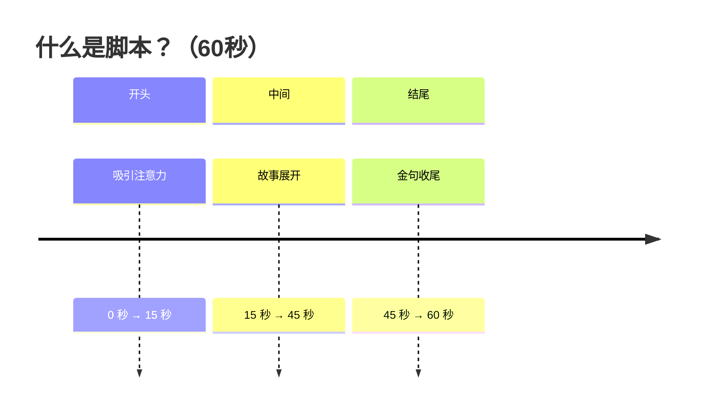

## 怎么拍短视频

我会用很短的时间告诉你如何把播放量从零做到上万。

短视频黄金三秒很重要，但是比黄金三秒更重要的是结构。

很多人拍短视频播放量一直卡在几百，不是不会说话，而是想到哪里就说到哪里，没有逻辑，观众听了十秒之后根本不知道你在表达什么内容。 

老规矩其他人不管，但是阿玖内部的小伙伴点赞收藏反复的看，多看几遍。什么是结构？就是拍短视频的时候先讲什么后讲什么，最后讲什么。 

乔布斯发布产品为什么大家都很喜欢听？因为他的ppt其实就是他演讲的结构。周星驰拍电影也有结构，因为他们有剧本，剧本用了最好的结构。李诞的脱口秀演员也是有结构的，因为他们提前准备了逐字稿，逐字稿用了最经典的结构。 

短视频大v基本上也有类似的结构，比如姜胡说、朴素之道都用了最经典的结构，而且一直反复在用。一个好的结构可以让你的视频轻松突破500。

我之前的视频就是这么做的，播放量从零做到了上万，结构不用太多，掌握1到2个就可以了。 普通人怎么做？

假设这是一个60s 的短视频。

前面是开头，中间讲一个故事，结尾给一个方案。一步电影，好的开头就是成功的一半；那短视频也一样，好的开头决定质量，通常15秒决定一个视频的生死，用户在 15s内很容易划走。

中间讲一个故事，你可以讲述大家耳熟能详的故事。要么讲自己的故事，自己的故事求真，要么讲名人的，名人的就是借势。

然后是结尾，结尾通常给出一个解决方案，可以是一个金句，也可以是号召行动，因为一个短视频，用户不关心你的所有内容，他关心得到一句话，收获一个答案。 记住，金句的力量是很大的。

为了做好黄金 3 秒，开头的时候，可以做一个分镜头，剪映里面叫画中画。你可以做一个动作，有博主敲敲桌子，有的人加一张内容丰富的图片，目的是吸引用户的注意。能够接住用户继续往下看。

为什么要讲故事？因为大家都是成年人，成年人都喜欢听故事，不喜欢受教育，所以一上来不要讲什么大的道理。这下你对短视频的结构有了理解了，你去看别人的优秀的作品是不是有不一样的视角了？

没有人天生会游泳，也没有人天生会做短视频，下水游泳比看教学视频学得更快。

