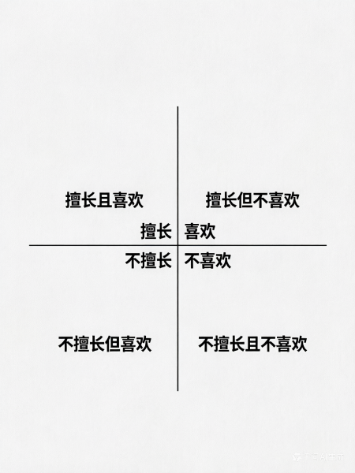

## 阿玖日记：
2026 .5.30

 帮我写个日记吧

1. 睡眠与健康
   昨晚睡眠质量一般，但还算过得去，没怎么做梦。主要是咳痰的问题，昨天的痰特别黏稠，感觉像干块一样，一块一块的，还带点绿色。今天稍微好了一点，但痰量还是比较多，尤其是在吃饭或者某些时候，痰会突然往上涌。

2. 今日新知
   今天最大的收获是把 Obsidian、Git 和 Jupyter 统一了起来，我觉得这是今天最重要的进展。如果能集中在一个地方办公、干活，那是最好的。我找了个地方，把上网的、电视的、大模型的，还有工作台的全部放到一起了（包括我的 Git 也都放在一起了）。我觉得这种方式比较好。没想到 Mac 电脑给了我这么便捷的一个方式，直接做一个硬连接就过去了，特别好。  目前需要解决的问题是图片无法显示：从 Obsidian 同步到 Git上好像看不了图片。目录路径是对的，都在 images 文件夹下面，这个问题接下来再想想办法。

3. 生活方式
   要认真落实扫地的方法，把家务分散到每天来做。另外，厕所要认真清洗，窗户也要经常打开通风，确保室内没有异味。

4. 吃得什么
   晚上去必胜客买了一个披萨，是德州烤肉味的，还是香肠卷边的，一个 59 元。我跟若西一个人吃了一半，全部吃完了，觉得特别好吃。后来又去买了一点荔枝和蓝莓：云南蓝莓又上市了，个头比较大。虽然今天没打折，一小盒 13 元（稍微贵一点），但能吃两到三天。荔枝大概 10 元一斤。
5. 总结一下今天用的几个工具：

Obsidian、Typeless、今天装了一个 Obsidian 的插件，说是可以编辑图片，但我用的不太好。
   (b) 目前需要解决的问题是图片无法显示：从 Obsidian 同步到 Gitee 上好像看不了图片。
   (c) 目录路径是对的，都在 image 文件夹下面，这个问题接下来再想想办法。

## 马伯庸的日记的方法
2026.5.30

马伯庸写日记的方法：
采用分栏表格形式，每日记录约十条：
- 工作事项：记录工作任务与进展
- 今日新知：收集跨行业知识点，不做主观评价
- 突发灵感：捕捉即时想法
- 睡眠质量：晨起评分（1-5分）
- 昨日梦境：能回忆起即记录
- 金句

特点：坚持一年后，这些零散信息会形成丰富的个人认知库。不用特别去记忆，你都应该能够记住，主要能够坚持下来。

## 价格歧视
2026.05.30

【知识名字】
什么是价格歧视？
一句话，就是对某些人收高价，而对某些人收普通的价格。根据人们意愿进行收费。

【核心要点】

什么是价格歧视？这是纳瓦尔和 Naval（海军）对话时谈到的一个微观经济学概念。

通常来说，我们更关注边际成本为零的产品以及如何规模化复制，但价格歧视其实非常重要。因为不同的人愿意支付的价格不同，你可以根据这种意愿差异来定价。具体分为两种情况：

1. 向上定价
   在标准服务的基础上提供一些增值服务，或者满足一部分人的财富欲望和虚荣心。在这种情况下，你可以收取更高的价格。通常一些服务的定价甚至可以达到普通标准的 5 到 10 倍。

2. 向下定价
   通过牺牲一部分人的时间等成本来降低价格。比如在闲时定价，此时的价格要远远低于高峰期。这和航空公司的逻辑是一样的，通过在淡季打折来吸引更多用户购买服务。

这就是价格歧视的两个具体应用案例。

总之，你可以根据人们的支付意愿收取不同的费用。

【补充案例】  
案例：

航空公司的商务舱座位的价格通常是经济舱座位的五到十倍。但航空公司提供更宽敞的座椅、更大的腿部空间和免费饮料等增值服务，成本却低得多——可能只是普通座位的两到三倍。

健身教练把价格定在 500 元/每小时，那么就将部分人拦在门外，于是他们推出闲时特惠卡”（仅限工作日上午使用，价格200元），吸引一部分不愿意付高价的人，以此来增加收入。

许多企业软件公司都采用价格歧视策略，本来免费或低价版本几乎可以满足您的需求。但如果您想要更安全的版本、托管在您自己的网站上的版本，或者具有多用户管理功能以便 IT 人员监控所有情况的版本，您最终可能需要支付 10 倍甚至 100 倍的价格。

个人思考：

富人更愿意支付更高的价格。
穷人更愿意支付廉价的价格。

## 复述

2026.5.30

写作在未来是一种非常赚钱的方式。

这是今天看李笑来播客时听到的观点，我比较认可。其实不只是现在，写作一直以来都是很赚钱的方式。

有人认为 AI 能大量生成内容，可以替代人工，所以写作就不值钱了。但事实并非如此——有价值的内容，大家依然愿意付费。AI 味太重的内容，用户体验并不好。

所以，真正的写作在未来依然很有市场。尤其是近几年，很多人通过杠杆——包括自媒体、出书等形式——取得了巨大的成功。作家大冰，写书的收入高达几千万。

那怎么写作呢？

复述是重要的方法，在国外也叫费曼学习法。

其实这个技能我们从小就会，只是忽略了。小学老师要求我们背诵和复述，通过复述来学习，效率最高。物理学家费曼的方法，本质上就是复述。

学习时，可以按照这五步来做：

1. **消化**：先去消化你学习的内容。
2. **拆解逻辑**：分析背后的逻辑和原因。
3. **自我复述**：尝试自己复述出来。能复述出来，才代表你真正理解了。
4. **讲给别人听**：在理解的基础上，尝试讲给别人听。
5. **简化**：把你理解的东西进行简化，让大家都听明白。

在学习过程中，有一个更强大的复述手段——**写教程**。它的力量比写笔记、口头复述更强悍。

## 短视频起号的方法

第一步：找选题
算法懂我，算法懂你。
算法看得懂，观众才能看得到。
用结果判断算法，低粉爆款。
热点宝，蝉妈妈。

第二步：抄开头。开头原封不动的照抄。

第三步：列观点。

原视频取一半的观点，开头和结尾的观点照搬。
去优秀的评论区找热点话题。

第四步：抄结尾。
填内容，内容无好坏，只有风格。

## 写和拍是两个系统

2026.05.30

每天写点什么和每天拍点什么是独立的系统。

每天写点什么可以超过每天拍点什么。

每天写点什么主题基本上可以固定：自媒体、个人成长、读书方法、认知提升、赚钱能力。
素材的来源：书籍、博客（比如纳瓦尔博客）、知乎收费的内容。

每天拍点什么可以借鉴别人的开头和结构，将每天写点什么加进去。

每天拍点什么内容要按照这种模式做：

搭骨架——写开头——写金句——加钩子——加搜索词。

## 要事第一

> “我们要根据原则，而不是根据反应来生活。”
>            —— 史蒂芬·柯维（Stephen Covey）

为什么你每天忙到晚，却依然觉得自己一事无成？

很多人陷入了一个致命陷阱：把“救火”当成“工作”，把“瞎忙”当成“能力”。向那些比你优秀的人学习，你会发现他们成功的方法其实只有一招：要事是第一

什么是要事第一。

柯维在《高效能人士的七个习惯》里提出四象限法则的概念，按重要和紧急程度将事情分为四类，而我们要把精力投放在重要不紧急的事儿上，这重要不紧急的事就是要事第一。

什么是重要不紧急的事儿？

一句话就是那些能直接创造公司价值，能提升自己底层能力的事。

比如你是一个牙医专业专科毕业。那么你毕业之后，你需要拿到助理医师资格证，医师资格证。你大约要花 5-6 年的时间完成。那么这对你来说，就是要事第一。

因为这关系到你的饭碗，当你离开学校之后，没有人会告诉你怎么做，但是你应该自己知道怎么做。因为你每天做的事情就是把通过这两个证书作为要事放在第一位。

提升自己底层的能力都有哪些呢？

比如：
销售能力；
自学能力；
写作能力；
演讲能力；
沟通能力；
赚钱能力；

天赋：
音乐天赋；
数学天赋；

……

这些能力代表了你的核心竞争力，尽管这个社会不会催你，但三年后决定你是站在高处，还是留在原地。

列出“四象限清单”，标注每件事的“擅长”和“喜欢”，找到你喜欢且擅长的事情,

喜欢且擅长的事，每天只挑一到两件来做。

强制分配：每天必须给“喜欢且擅长的事”分配 2 小时的专注时间。

>“最没效率的事，就是以最高的效率去做全然不该做的事。”
>
>—— 彼得·德鲁克（Peter Drucker）

做事方法。

2026.5.30

## 成事方法

效率是以正确的方式做事，效能是做正确的事。

——彼得·德鲁克

关于做事的方法，瑞达利欧在他的《原则》一书里面有详细的论述，他说实现人生的愿望一共 5 个步骤：

1．有明确的目标。

2．找到阻碍你实现这些目标的问题，并且不容忍问题。

3．准确诊断问题，找到问题的根源。

4．规划可以解决问题的方案。

5．做一切必要的事来践行这些方案，实现成果。

这个是不是非常熟悉，我们有质量控制PDCA 循环理论，我们在学习中有学习的迭代法。

你是不是认为这是在说“鸡汤”，其实这是实打实的“科学工具”。

先从一个生活小事说起，这是我媳妇给的方法，非常管用。

如果我们的屋子不打扫，可能要不了几天，就杂乱不堪，还有很多味道。

所以，我们要给屋子打扫清洁，那是几天做一次大扫除呢，还是每天做一点点呢？

答案是每天做一点点。

你把原本要做大扫除的事情，分散成为每天做的事情。

每天起床后，花 10 分钟打开一下窗户，通一下风，确保室内空气流通。

每天下班后，花不到10 分钟时间拖一下地，可以很好解决城市灰尘的问题。

每天洗澡后，花不到 5 分钟的时间拖一下厕所地面、刷一下蹲便和马桶，可以很好解决厕所发臭的问题。

每周花半小时左右，做一下桌面、柜子等清洁，整个环境都很舒服。

不要把事情堆在一起做，而是将一个事情拆成最小且可以执行的单元。

不要用战术上的勤奋，掩盖战略上的懒惰。

# 每天写点什么

#### 稀缺效应与存物癖

当机会变得稀缺时，人们会本能地认为其价值升高，从而产生非理性的抢购行为。

>《怪诞心理学》讲了一个故事，一个镇上没有太多的白糖需求，店主为了卖出更多的白糖，在店门口写了一个告示牌子：“本店新进白糖一批，每户限购两斤，凭本购买，欲购从速，过期不候”。结果告示贴上后不久，白糖就卖完了，甚至还有人求这位商店经理多批几斤。

这其实是用户的一种怪诞行为行为，就是用户喜欢存东西，当他看见有东西限价的时候，只要见到限购的时候，他都觉得应该把它买下来，不管他现在有没有，他都有这种心心理习惯。

其实，我们书架上没读的书、电子书城里没打开的课，也是一种“怪诞行为”。

比如说读书，我知道大家也喜欢读书，我们家里面买了好多书，但是可能大部分没有读，我们在电子书书架上是不是也存了很多付费的书籍，但是我们真正的读完了吗？

我们怎么办呢？

1. 意识到“拥有”不等于“掌握”。

2. 少即是多：一次只买一本，或者一次只读一本。

3. 以输出倒逼输入：只有当你能把书读薄、讲出来的时候，才允许自己买下一本。

真正的富有不是书架上有多少未读的书，而是脑子里有多少已用的知识

如何读书？

>1. 作者究竟讲的是什么东西？
>
>2. 总结其核心概念、思维是什么？
>
>3. 书中最经典的故事是怎么写的？
>
>4. 我能不能用最简单的语言讲这个故事描述出来？尤其是要讲给我的读者听！
>
>5. 我联想到了什么？
>
>6. 能不能总结一个金句？

#### 两个字，把东西卖出去

查理·芒格说过一句话：到鱼多的地方去钓鱼。

很多人愁怎么赚钱，其实这事儿没那么复杂。告诉你两个字，你就全明白了。

今天雨挺大，我在轻轨门口看见一个大妈。她没用什么花哨的技巧，就用了两个字，雨伞就卖出去了。

她嘴里就喊着：“雨伞！雨伞！”

所以，卖东西难吗？真不难。

只要不是卖火箭那种高客单价的东西，普通生意的秘诀往往简单到极致。

不管什么产品，本质就是把东西放到有需要的人手里。

大妈选在下雨天、轻轨口，这就是“鱼多的地方”。有人没带伞，这就是“刚性需求”。

明白了这个道理，赚钱这事儿你就开窍了。

方法无非就两种：
* 第一种，我手上有货，我去找有需求的人。
* 第二种，我看见了需求，我再去想办法找货。

手段不一样，但逻辑是一回事。

生意的本质就一句话：在对的时间，出现在对的地方，解决别人的燃眉之急。

## 如何做短视频？

做短视频的方法。

### 1. 以终为始

你千万要一上来就去，学习定位，学习剪辑，学习钩子，学习怎么写文案。到最后还是一团浆糊

这世界是有捷径的，我们大部分人认为到达一个目标会非常的辛苦，需要很努力。

### 2. 提取框架
1. 对标。找到这个领域有结果的人或者是曾经热门的视频。
2. 多视角看问题。我们不仅仅是要在观众的角度看问题，我们还需要从作者以及通过不同的角度阅读这个视频
3. 像素级模仿。自己能够复制。
### 3.行动：
1. 做一个短视频
### 4. 验证：
1. 用AI检查验证。
2. 发布作品进一步验证。
### 5.提取经验
1. 根据系统算法反馈的结果总结，提取有价值内容，作为后期优化的依据。
2. 根据用户的反馈，提取价值的问题和需求，作为后期继续优化的依据

### 抖音短视频有哪些计划

中视频合作计划，需要西瓜，头条，抖音三个账户，缺一不可，如果头条账户被封了。是无法加入的。

创作者伙伴计划，没有三个平台的要求，但是需要有一些硬性条件，比如 30 天有 5000 人互动，还有 30 天的作品超过 20 条。粉丝有 5000➕以上。

可以试一下这个创作者伙伴计划。

