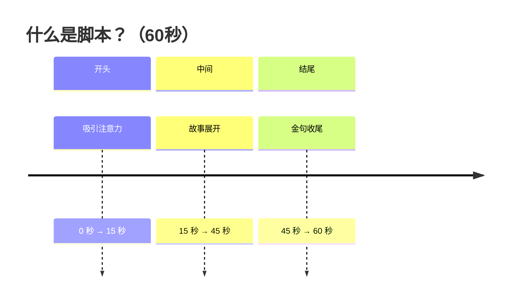

 如何学习：
 
一个人最顶级的能力就是高效学习。大多数人学东西慢不是因为笨，而是问题出在了方法上。你身边有没有这样的人，明明他是跟你一块去学，但是他记得或者学的就是比你快、比你牢固。其实他们也不是什么天才，他们只是懂得如何顺着大脑的节奏去学习，而我们大多数人都是在和大脑去对着干。 关于高效学习我之前在视频里讲过很多，今天再给大家讲一个容易忽略但是绝对是高效学习最底层的逻辑之一，就是耶基斯-多德森定律(Yerkes-Dodson Law)。简单来说就是你的压力和你的学习效率还有工作效率成一个倒u型的曲线。 当你的压力过低的时候，比如你在被窝里去背单词就会感到想睡觉动力就不足，那你学习效率就很低。而你的压力过大的时候，这时候紧张、焦虑、恐慌则会占据你全部的注意力，甚至会让你崩溃，这时候学习效率也同样会急剧的下降。 而高效学习的压力区间就在于你压力适中的时候，这时候你的大脑的注意力反应力是最快的。怎么去构建一个既不伤害身体又能让自己保持中度压力的状态？核心的办法就是你要学会环境切换。 如果你想高效的学习就不要在家里或者宿舍里去学习，因为大脑在这个环境中接受的信号就是吃喝玩乐、放松然后打游戏。当你试图在一个很舒适的沙发上去学习的时候，你的大脑默认的就是一种很节能的模式，很难去切换到这种高功率的学习模式。 但这个时候如果你换一个环境，比如去咖啡馆或者是图书馆，或者是你处于工作的办公室中，处于适当的紧张的状态，这时候你的肾上腺素还有去甲肾上腺素都会分泌增加，它会让你的大脑的突触的连接效率增加，帮助你记忆快速的去形成，而且会让你的注意力去收窄，屏蔽掉周边一些无关的噪音，就类似于进入到一种高集中的战斗模式。 有些同学说我不具备这种环境切换的条件，怎么办？那你就可以在家里去设置一个专门的学习区或者是工作区域，保证在物理上和你的日常生活有一个环境上的隔绝。 学习的差距从来不是天赋决定的，而是谁能找准大脑的这种高效发力点。重启人生的关键也不是去盲目的努力，而是要去找对规律，这样才能让你的每一份付出才能有回报。 今天是我早起的第153天，我计划早起1000天，实现财富和时间自由。如果你也想行动，但总是动不起来，那我写了一本3万字的无痛自律手册，可以来找我。

2026.5.30

拍口播视频的核心是文案，那么文案的核心又是什么呢？

「人设」在过去的18个月时间里，我写了1000多个口播文案，其中1万赞以上的视频超过100个，我的抖音账号也涨到了20万粉丝以上。

这个视频我想分享一下我对于口播文案的5个感受，相信对大家会有所启发：

1.  口播内容要讲用户关心的
   很多人一上来就讲自己专业的东西，用户一听和他没有关系，几秒的时间就划走了。真的好的口播内容要么给用户提供价值，要么给用户提供情绪，要么引发大家的思考并表达出来。

   好的口播文案，一定那种可以让用户互动起来的，这是口播文案的核心，
   
   只有这样，你的短视频才能做好，所以一定要说用户关心的内容。

2. 请使用大白话给大家听
   新手最容易表达自己，真正的有经验的博主，都是用最朴素的大白话，去解释最复杂的逻辑关系，因为真理本身就是简单的。

3. 内容要做到能够让人相信
   这意味着你要么给出数据去支撑，要么说出你的亲身体验，要么通过书上的证明或权威的说法来认证。

4. 要用文案来给自己立人设
   也就是我经常在直播间说的“你是谁”。只有这样，才能给用户留下具有“活人感”的印象。

5. 文案中是否有让人想转发的金句或观点
   这非常重要，因为用户很难记住你说的每一句话，但一定会记住对他们最有触动的那几句。

5.27

分享一条干货，怎么拍短视频？

我会用很短的时间告诉你如何把播放量从零做到上万。

短视频黄金三秒很重要，但是比黄金三秒更重要的是结构。

很多人拍短视频播放量一直卡在几百，不是不会说话，而是想到哪里就说到哪里，没有逻辑，观众听了十秒之后根本不知道你在表达什么内容。 

老规矩其他人不管，但是阿玖内部的小伙伴点赞收藏反复的看，多看几遍。什么是结构？就是拍短视频的时候先讲什么后讲什么，最后讲什么。 

乔布斯发布产品为什么大家都很喜欢听？因为他的ppt其实就是他演讲的结构。周星驰拍电影也有结构，因为他们有剧本，剧本用了最好的结构。李诞的脱口秀演员也是有结构的，因为他们提前准备了逐字稿，逐字稿用了最经典的结构。 

短视频大v基本上也有类似的结构，比如姜胡说、朴素之道都用了最经典的结构，而且一直反复在用。一个好的结构可以让你的视频轻松突破500。

我之前的视频就是这么做的，播放量从零做到了上万，结构不用太多，掌握1到2个就可以了。 普通人怎么做？

假设这是一个60s 的短视频。

前面是开头，中间讲一个故事，结尾给一个方案。一步电影，好的开头就是成功的一半；那短视频也一样，好的开头决定质量，通常15秒决定一个视频的生死，用户在 15s内很容易划走。

中间讲一个故事，你可以讲述大家耳熟能详的故事。要么讲自己的故事，自己的故事求真，要么讲名人的，名人的就是借势。

然后是结尾，结尾通常给出一个解决方案，可以是一个金句，也可以是号召行动，因为一个短视频，用户不关心你的所有内容，他关心得到一句话，收获一个答案。 记住，金句的力量是很大的。

为了做好黄金 3 秒，开头的时候，可以做一个分镜头，剪映里面叫画中画。你可以做一个动作，有博主敲敲桌子，有的人加一张内容丰富的图片，目的是吸引用户的注意。能够接住用户继续往下看。

为什么要讲故事？因为大家都是成年人，成年人都喜欢听故事，不喜欢受教育，所以一上来不要讲什么大的道理。这下你对短视频的结构有了理解了，你去看别人的优秀的作品是不是有不一样的视角了？

没有人天生会游泳，也没有人天生会做短视频，下水游泳比看教学视频学得更快。
